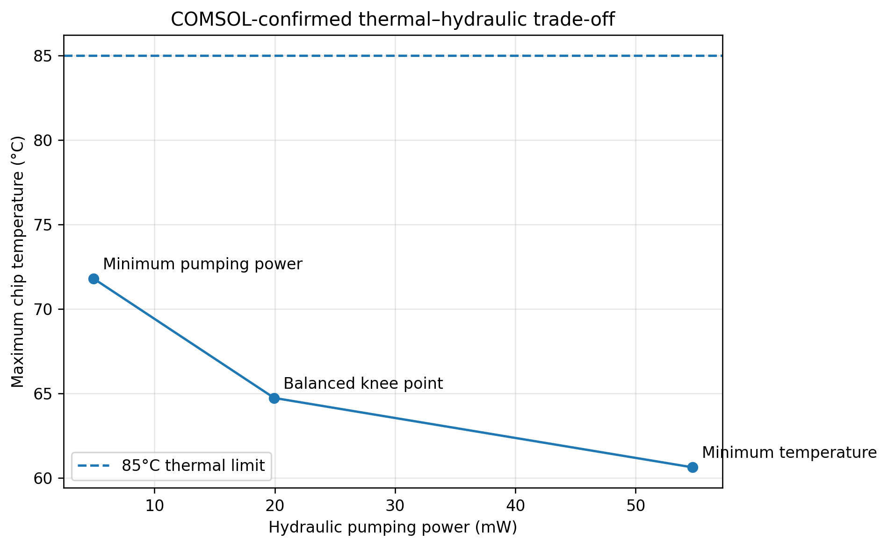
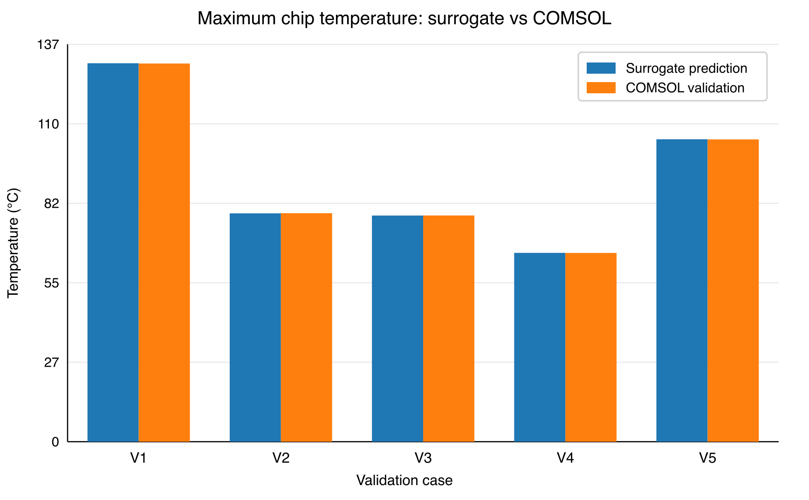

# Microchannel Cold-Plate Design: CFD, Surrogate Modeling and Trade-Off Analysis

**Yuan Gao | Thermal engineering portfolio | COMSOL 6.3 · Python · Gaussian-process surrogate study**

A simulation-based design study of a **100 W, ten-channel liquid cold plate**, connecting conjugate heat transfer, flow/TIM parameter studies, independent off-grid prediction checks, and COMSOL confirmation of selected Pareto candidates.

## The engineering result in one minute

The recommended **balanced knee-point candidate** uses **0.188 L/min**, reaches **64.73°C maximum chip temperature**, and retains **20.27°C margin** to the project's 85°C limit. Compared with the confirmed minimum-temperature candidate at 0.30 L/min, it reduces **hydraulic pumping power by 63.5%** for a **4.11°C temperature penalty**. These are simulation results for the same fixed cold-plate configuration, not measured hardware or facility energy savings.

| COMSOL-confirmed candidate | Flow (L/min) | Maximum chip temperature (°C) | System resistance (K/W) | Pressure drop (kPa) | Hydraulic power (mW) |
|---|---:|---:|---:|---:|---:|
| Minimum temperature | 0.300 | 60.618 | 0.3562 | 10.941 | 54.706 |
| **Balanced knee point** | **0.188** | **64.725** | **0.3973** | **6.367** | **19.949** |
| Minimum pumping power | 0.100 | 71.790 | 0.4679 | 2.968 | 4.947 |

Source: [confirmation table and raw COMSOL exports](results/final_engineering_results/README.md). All three candidates meet the 85°C temperature criterion. The recommended point balances temperature and hydraulic cost; it is not claimed to be a unique global optimum.



## What this demonstrates

**CFD and transport physics:** a chip/TIM/spreader/cold-plate heat path, conjugate heat transfer, integrated flow checks, and thermal/hydraulic post-processing.

**Data and surrogate modeling:** a corrected **45-case flow/TIM dataset** and a reported Gaussian-process optimization study. Five separate off-grid COMSOL comparisons give **0.0507°C mean and 0.0994°C maximum absolute chip-temperature error**; pressure-drop MAPE is **0.0466%**. These metrics are recalculated from the preserved prediction/comparison records, not from a newly retrained model.

**Engineering decisions:** select representative Pareto candidates, compare temperature margin against hydraulic pumping cost, and confirm the selected points in COMSOL rather than accepting surrogate predictions alone.

## Final-study configuration

| Quantity | Fixed condition / study range |
|---|---|
| Chip load / inlet coolant | 100 W / 25°C water |
| Channels | 10 parallel channels, 0.30 mm width × 0.70 mm height |
| Flow domain | 0.10–0.30 L/min total |
| TIM thickness | 0.05–0.15 mm |
| TIM conductivity | 1.5–6 W/(m·K) |
| Dataset | 5 flows × 3 thicknesses × 3 conductivities = 45 cases |
| Confirmation TIM setting | 0.05 mm / 6 W/(m·K), recorded as optimization metadata |
| Temperature criterion | Maximum chip temperature ≤85°C |

The final confirmation exports do not independently contain the TIM parameter columns. The original README and early mesh/flow records describe an earlier 0.50 × 0.50 mm channel baseline; they remain historical records, not the final geometry specification.

## Review the evidence

| Review goal | Where to start |
|---|---|
| Final design decision and original plots | [Final engineering results](results/final_engineering_results/README.md) |
| Five off-grid comparisons | [Surrogate validation report](report/validation/surrogate/README.md) and [comparison CSV](data/processed/validation/surrogate/coldplate_validation_comparison.csv) |
| Training grid and split labels | [45-case dataset](data/processed/training/coldplate_ml_core_45.csv) and [dataset provenance](data/processed/training/SOURCE.md) |
| Methods, reproducibility and caveats | [Evidence and reproducibility](docs/portfolio/EVIDENCE_AND_REPRODUCIBILITY.md) |
| Resume bullets and interview narrative | [Application materials](docs/portfolio/RESUME_AND_INTERVIEW.md) |
| What this consolidation changed | [Release notes](docs/portfolio/RELEASE_NOTES.md) |



## Reproduce the reported evidence summary

From the repository root, with Python 3.10 or later:

```bash
python scripts/review_project1.py
python -m unittest discover -s tests -p 'test_project1_portfolio.py' -v
```

The new review script requires only the standard library. It verifies source-file hashes, the 45-case grid and split, derived thermal/hydraulic identities, five-case error metrics and classifications, and the balanced-design trade-off. It does **not** run COMSOL, train a surrogate, or recreate the original optimization search.

For the existing starter-code tests, install the project's requirements and run `python -m pytest tests/`. The inherited `src/train_models.py` and Streamlit app are early scaffolding, not a packaged final GPR inference service. Final model checkpoint/training provenance still needs reconciliation before claiming end-to-end retraining or a deployed prediction demo.

## Limits that matter

ROM/surrogate agreement with CFD is not experimental validation. The corrected 45-case table and final confirmation exports lack the complete final-geometry energy-balance fields; earlier validation reports apply to their documented earlier configuration. The 85°C criterion is project-defined. Restrict surrogate claims to the sampled flow/TIM domain and fixed geometry, inlet condition and heat load. Preserve uncertainty and infeasible cases rather than removing them to improve reported performance.
