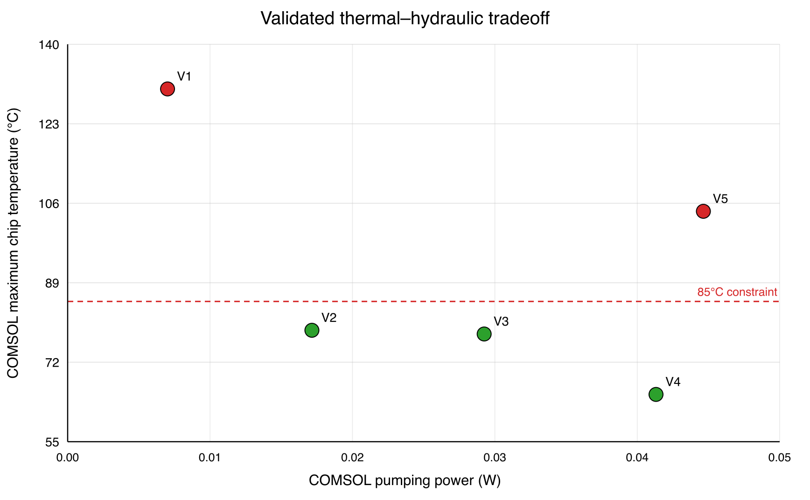

# Surrogate Model Validation

Five independent, off-grid COMSOL cases were used to validate the cold-plate
surrogate inside the trained design ranges. The cases vary total flow rate,
TIM thickness, and TIM conductivity while holding the geometry, 100 W chip
load, and 25 °C inlet temperature fixed.

## Results

| Output | MAE | Maximum absolute error | MAPE | R² | Status |
|---|---:|---:|---:|---:|:---:|
| Maximum chip temperature | 0.0507 °C | 0.0994 °C | 0.0527% | 0.999994 | PASS |
| System thermal resistance | 0.000507 K/W | 0.000994 K/W | 0.0736% | 0.999994 | PASS |
| Mass-weighted outlet temperature | 0.1266 °C | 0.1573 °C | 0.3950% | 0.997318 | PASS |
| Pressure drop | 2.79 Pa | 5.01 Pa | 0.0466% | 0.999998 | PASS |
| Pumping power | 9.74 × 10⁻⁶ W | 2.19 × 10⁻⁵ W | 0.0466% | 0.999999 | PASS |

The surrogate also reproduced the 85 °C pass/fail classification for all five
cases: V1 and V5 fail, while V2, V3, and V4 pass. Maximum prescribed-flow error
was 0.000169%, and maximum inlet/outlet flow imbalance was 0.361%.

## Engineering interpretation

- V2 is the lowest-pumping-power feasible case: 78.831 °C at 0.01813 W.
- V4 gives the lowest maximum chip temperature: 65.110 °C at 0.04368 W.
- V5 is 39.17 °C hotter than V4 despite 8.1% higher pumping power, showing
  that increased flow cannot compensate for a thick, low-conductivity TIM.
- Outlet temperature has the largest relative prediction error, but its
  maximum absolute error remains only 0.157 °C.

## Files

- [Analysis workbook](coldplate_surrogate_validation_analysis.xlsx)
- [Case-level comparison data](../../../data/processed/validation/surrogate/coldplate_validation_comparison.csv)
- [Metric summary](../../../data/processed/validation/surrogate/coldplate_validation_metrics_summary.csv)
- [Validation plots](../../../figures/validation/surrogate/)

## Scope and limitation

These results support interpolation within the sampled training ranges; they
do not establish extrapolation accuracy. The available off-grid exports did
not include all thermal energy-balance terms, so energy-balance error is not
reported for this validation set.
